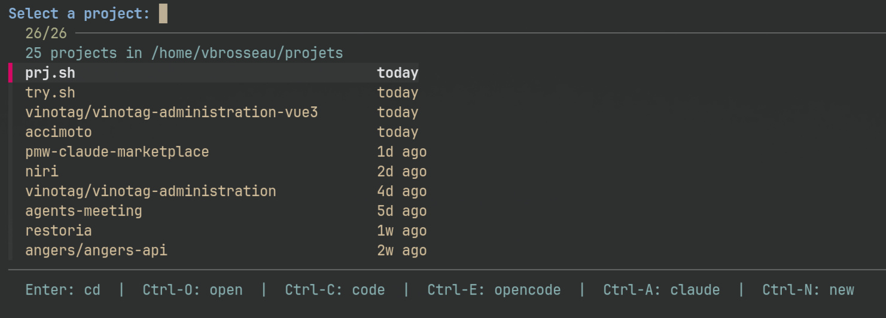

# prj.sh — fzf-powered lightweight project launcher


_Your projects deserve quick access._ 🚀

> A simplified Bash fork inspired by [try.sh](https://github.com/c4software/try.sh), using `fzf` for navigation.  
> Designed for developers who want fast, fuzzy project switching with multiple editor integrations.

---

## What It Does

Tired of `cd`-ing through endless directory trees to find your projects?

**prj.sh** helps you navigate and manage your project folders with ease:

- **Instant fuzzy search** via [`fzf`](https://github.com/junegunn/fzf)
- **Autojump-style navigation** — `proj <query>` jumps directly to the first match, no picker needed
- **Smart age display** (days, weeks, months)
- **Multiple editor integrations** (VS Code, OpenCode, Claude)
- **Quick project cloning** via Git (auto-detects Git URLs)
- **Auto-expanding folders** (shows subdirectories when parent has no files)
- **Simple Bash script — minimal dependencies**



---

## 🚀 Quick Start

```bash
curl -sL https://raw.githubusercontent.com/c4software/prj.sh/main/prj.sh -o ~/.local/bin/proj
chmod +x ~/.local/bin/proj

echo 'eval "$(~/.local/bin/proj init)"' >> ~/.zshrc # or ~/.bashrc
```

### Dependencies

**Required:**

- `fzf` (for interactive selection)
- `git` (for cloning repositories)
- [`gum`](https://github.com/charmbracelet/gum) (for input prompts)

---

## Usage

```bash
proj                           # Browse and open projects interactively
proj <query>                   # Jump directly to first matching project (autojump-style)
proj <git-url>                 # Clone a git repository (auto-detects URL)
proj new [name]                # Create a new project folder
proj clone <uri> [name]        # Clone a git repository into PROJ_PATH
proj list|ls                   # List all projects with age
proj init                      # Initialize proj (for shell integration)
proj --help                    # Show help
```

Examples:

```bash
proj redis          # → jumps directly to the most recently used project matching "redis"
proj new my-app
proj https://github.com/c4software/prj.sh          # Auto-detects Git URL
proj clone https://github.com/c4software/prj.sh
proj list
```

---

## Example session

```bash
$ proj redis
# → jumps directly into ~/projets/redis (most recently modified match)

$ proj
# Opens the interactive fzf picker:
→ redis                          2d ago
  redis-cache                    1w ago
  redis-test                     2w ago
  ➕ Create new
```

With a query, `proj` behaves like `z`/`autojump`: it picks the most recently modified matching project and jumps straight in.
Without a query, press <kbd>Enter</kbd> to `cd` into the selected project, or use keyboard shortcuts for other actions.

---

## Features

### Fuzzy Project Search

- Real-time search powered by `fzf`
- Displays project age (days, weeks, months, years)
- Sorted by last modification time
- Automatically creates new directories if no match is found

### Git Integration

Clone repositories directly:

```bash
proj clone https://github.com/user/repo.git
# → ~/projets/repo
```

Or just pass a Git URL directly:

```bash
proj https://github.com/user/repo.git
# Auto-detects and clones automatically
```

### Multiple Editor Support

Open projects with your favorite tools using keyboard shortcuts:

- **Enter**: `cd` into the project directory
- **Ctrl-O**: Open in file manager (Finder/xdg-open)
- **Ctrl-C**: Open in VS Code
- **Ctrl-E**: Open with OpenCode
- **Ctrl-A**: Open with Claude
- **Ctrl-N**: Create new project

### Smart Directory Expansion

Projects containing only subdirectories (no files) are automatically expanded one level, showing you the actual working directories without extra navigation.

### Unique Naming

If a project name already exists, **prj.sh** automatically appends a number:

```bash
proj new redis
# Creates: redis

proj new redis
# Creates: redis-2
```

---

## Configuration

Change the default storage path:

```bash
export PROJ_PATH=~/code/projects
```

Default: `~/projets`

---

## Keyboard Shortcuts

| Key / Combo     | Action                    |
| --------------- | ------------------------- |
| ↑ / ↓, Ctrl+J/K | Navigate                  |
| Enter           | cd into project directory |
| Ctrl+O          | Open in file manager      |
| Ctrl+C          | Open in VS Code           |
| Ctrl+E          | Open with OpenCode        |
| Ctrl+A          | Open with Claude          |
| Ctrl+N          | Create new project        |
| Esc / Ctrl+C    | Cancel / quit             |

---

## Philosophy

You have projects. You switch between them constantly. You want it fast.

**prj.sh** makes project navigation effortless — fuzzy search, multiple editors, instant access.

---

## License

MIT — do whatever you want with it.

---

### Credits

- Original concept: [tobi/try](https://github.com/tobi/try) (Ruby version)
- Bash implementation: [try.sh](https://github.com/c4software/try.sh) by [@c4software](https://github.com/c4software)
